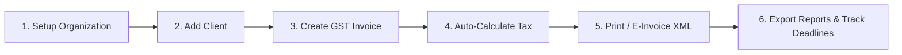

# QuantumBilling ⚡

> **Next-Generation GST Invoicing, E-Invoicing, and Tax Compliance Software for Indian Businesses.**

QuantumBilling is an all-in-one financial billing and compliance platform designed specifically for Indian enterprises, SMEs, accountants, and freelancers. It automates complex GST computations, eliminates manual filing errors, and empowers businesses to issue beautiful, legally compliant invoices in seconds.

---

## 💼 Why Business Owners Choose QuantumBilling

Running a business in India requires strict adherence to GST regulations. Mistakes in tax classification, inaccurate calculations, or missed return deadlines lead to hefty penalties, blocked Input Tax Credit (ITC), and strained vendor relationships.

QuantumBilling simplifies the entire process into a seamless, automated workflow:

- **100% Tax Accuracy**: Never worry about tax math again. The platform automatically determines whether an invoice is **Intra-State (CGST + SGST)** or **Inter-State (IGST)** based on the buyer's and seller's locations.
- **GST 2.0 Ready**: Built directly on the restructured tax slabs (0%, 5%, 18%, and 40% rates under Notification No. 9/2025).
- **Audit-Proof Records**: Financial figures are locked at the moment of invoice issuance, guaranteeing that historical records and past tax filings remain permanent and tamper-free.
- **Save Time & Accountant Fees**: Export complete, CA-ready Sales Registers and Tax Liability summaries with a single click.

---

## 🌟 Core Business Features

### 1. Smart GST Invoicing & Documents
- **Complete Document Suite**: Create **Tax Invoices**, **Bills of Supply**, **Export Invoices**, **Credit Notes**, and **Debit Notes**.
- **Automated Tax Splitting**: Enter items and rates; the software automatically splits taxes into CGST, SGST, IGST, and Cess according to statutory rules.
- **Customer Directory**: Store and manage client GSTINs, PANs, billing addresses, state codes, and contact details for instant lookup.
- **Print & PDF Generation**: Deliver polished, branded invoices directly to clients or save them as PDFs with print-ready layouts.

### 2. Interactive Invoice Design Pad
- **Custom Brand Identity**: Transform standard, boring invoices into high-end, branded documents that impress your clients.
- **Visual Drag & Drop Customizer**: Customize invoice layout blocks, logos, fonts, payment terms, and color palettes with a live WYSIWYG canvas.
- **Real-Time Autosave**: Edits are preserved automatically as you design.

### 3. Government-Standard E-Invoicing (INV-01)
- **Official IRP Format**: Generate standard **INV-01 XML** e-invoice payloads ready for direct submission to the Invoice Registration Portal (IRP) or your GSP.
- **Pre-Submission Validator**: The software validates buyer GSTINs, HSN codes, and mandatory tax totals before file creation, preventing IRP rejection.

### 4. E-Way Bills & Transit Documentation
- Generate statutory E-Way bills for moving goods across state lines or exceeding invoice value thresholds.
- Tracks vehicle numbers, transport document numbers, and validity periods.

### 5. Statutory GST Compliance Calendar
- **Automated Deadlines**: Tracks statutory filing schedules calculated for the Indian financial year (April 1 – March 31):
  - **GSTR-1**: Monthly outward supplies return (due 11th of every month)
  - **GSTR-3B**: Monthly summary return & tax payment (due 20th of every month)
  - **CMP-08**: Quarterly statement for Composition taxpayers (due 18th following quarter)
  - **GSTR-9 & GSTR-9C**: Annual returns and reconciliation audits
- **Filing Status Tracker**: Instant visual tracking of what is **Pending**, **Filed**, or **Overdue**.

### 6. Built-in HSN / SAC Code Finder
- Quickly search through hundreds of goods (HSN) and services (SAC) codes.
- View verified, up-to-date GST tax slabs and descriptions before adding items to an invoice.

### 7. Financial Reports & Sales Registers
- **Executive Dashboard**: Track monthly sales trends, total revenue, tax collections, and top clients by billing volume.
- **One-Click CSV Exports**:
  - **Sales Register**: Detailed, itemized sales breakdown formatted for your Chartered Accountant.
  - **Tax Liability Summary**: Comprehensive breakdown of CGST, SGST, IGST, and Cess liabilities across customizable date ranges.

### 8. Enterprise-Grade Security
- **Two-Factor Authentication (2FA)**: Secure staff accounts using Google Authenticator, Microsoft Authenticator, or 1Password.
- **AES-256-GCM Encryption**: Sensitive portal secrets and 2FA credentials are encrypted at rest using military-grade encryption.
- **Brute-Force Protection**: Integrated rate limiting shields login and verification portals against automated dictionary and credential attacks.
- **Secure File Storage**: Deep SVG inspection blocks cross-site scripting (XSS) vectors during company logo uploads.

---

## 🚀 How It Works (The Business Workflow)



1. **Setup Organization**: Add your company name, GSTIN, registered address, bank details, and logo in Settings.
2. **Issue Invoices**: Select a client, pick your items/HSN codes, and let QuantumBilling automatically calculate the exact GST.
3. **Send to Clients**: Download instant print-styled PDFs or export e-invoices for portal upload.
4. **Stay Compliant**: Check the Compliance calendar for upcoming return dates and export your monthly Sales Register for filing.

---

## 🛠️ Getting Started & Technical Setup

For technical documentation, local environment setup, and deployment guides, please see:

- 📖 **[Local Running & Setup Guide (RUN.md)](file:///d:/QUANTUM_BILLING/QuantumBilling/RUN.md)** — Step-by-step instructions for running via **Docker Compose** or native **Elixir & PostgreSQL**.

### Quick Start with Docker
```bash
docker compose up --build
```
Open [http://localhost:4000](http://localhost:4000) in your browser.

---

## 📜 Technology Stack

- **Backend**: [Elixir](https://elixir-lang.org/) & [Phoenix Framework 1.8](https://phoenixframework.org/) on Erlang/OTP
- **Real-Time UI**: [Phoenix LiveView](https://hexdocs.pm/phoenix_live_view/)
- **Database**: [PostgreSQL](https://www.postgresql.org/) with [Ecto](https://hexdocs.pm/ecto/)
- **Styling**: [Tailwind CSS v4](https://tailwindcss.com/) & [daisyUI](https://daisyui.com/)
- **Server**: [Bandit](https://github.com/mtrudel/bandit) HTTP/2 server

---

## 📄 License & Legal

Built for modern Indian commerce. All rights reserved. See [`/terms`](http://localhost:4000/terms) and [`/privacy`](http://localhost:4000/privacy) when running the application.
